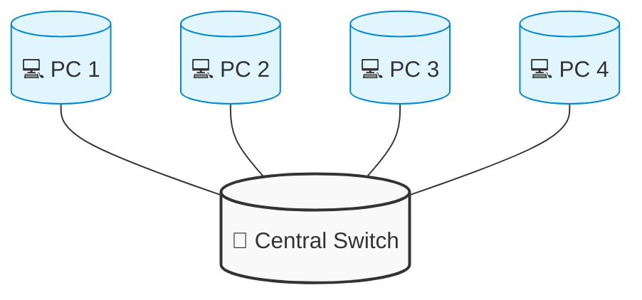
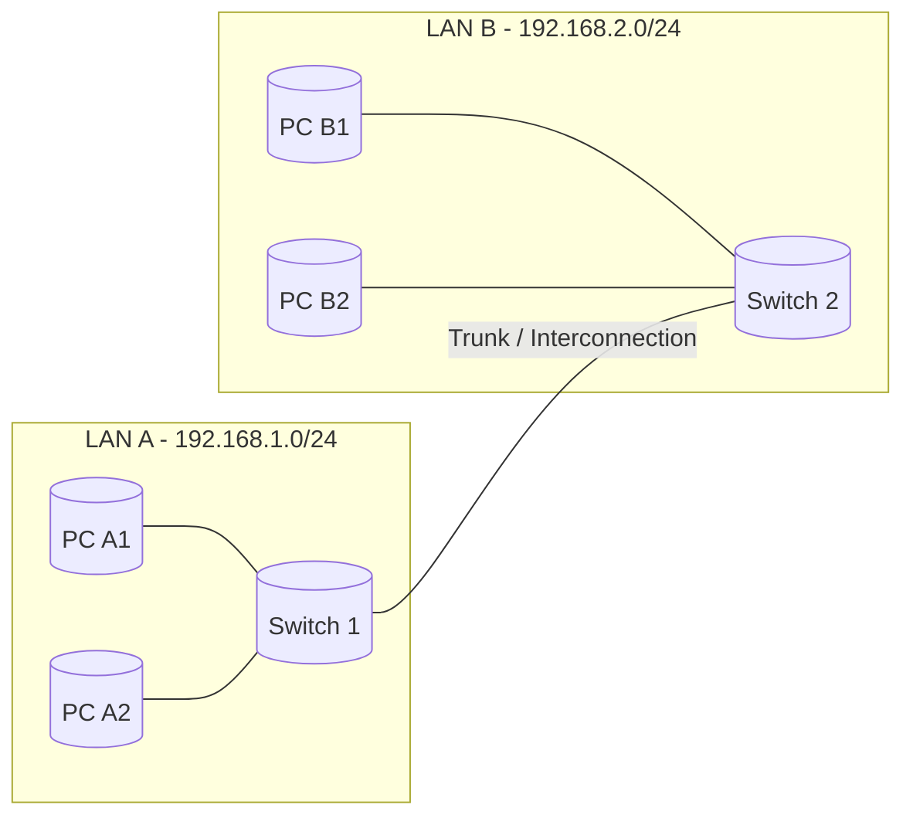
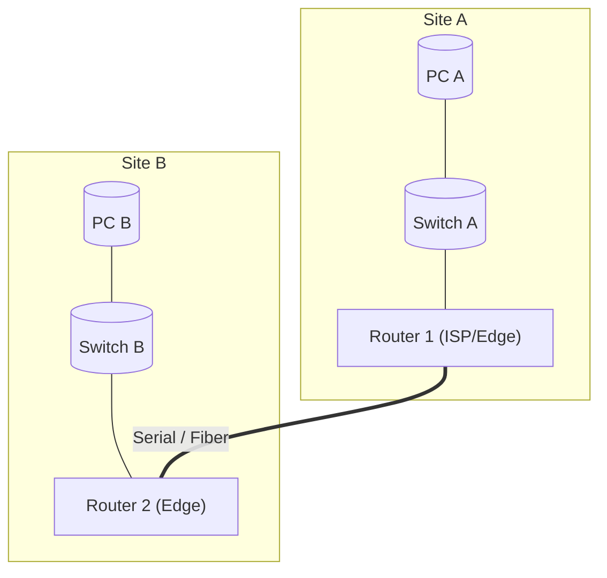
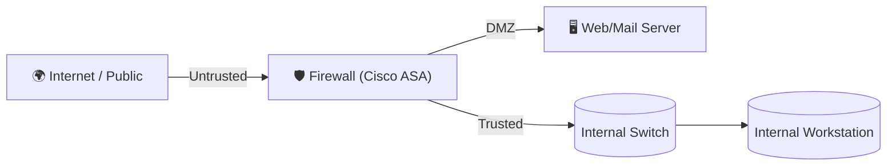

# 🌐 Software Engineering – Computer Networks

[](https://www.netacad.com/cisco-packet-tracer)
[](https://github.com/)
[](https://github.com/)
[](https://github.com/)

> **Repository for the "Computer Networks" course – 2nd Semester**  
> *Grade Achieved: **4.0/4.0 (A+) – Perfect Score!*

This repository contains all my lab practices, assignments, simulation tasks, and the final project for the Computer Networks course using **Cisco Packet Tracer**. Every `.pkt` file represents a network simulation designed to explore protocols, topologies, routing, and network services.

---

## 🏆 Achievement

- **Course:** Computer Networks (2nd Semester)
- **GPA Obtained:** **4.0/4.0**
- **Tools Used:** Cisco Packet Tracer

---

## 🖼️ Network Topology Diagrams

Below are the visual representations of the major network setups I built during this course. *(These Mermaid diagrams render directly on GitHub)*.

### 1. Star Topology
The most fundamental LAN setup where all end devices connect to a central switch.



### 2. Multi-LAN Connection (Inter-VLAN / Switched Network)
Connecting multiple Local Area Networks (LANs) to enable communication between different broadcast domains.



### 3. WAN & Routing (Router-to-Router)
Connecting two different physical locations (or networks) via routers to simulate a Wide Area Network (WAN).



### 4. Firewall & Security Zone
A high-level view of the firewall implementation used to secure internal networks from the outside.



---

## 📂 Repository Structure & Labs

The `.pkt` files are categorized based on the lab focus. Each file contains a complete simulation ready to run in Cisco Packet Tracer.

### 🏗️ Basic Topologies & LAN Setup
Files focusing on direct connections, switch-based LANs, and VLANs.

| File Name | Description |
| :--- | :--- |
| `star topology.pkt` | Centralized star topology with a single switch. |
| `2 LAN CONNECTION.pkt` | Connecting two separate LANs via a switch/router. |
| `task2.pkt` | General LAN practice topology. |
| `last task.pkt` | Comprehensive LAN setup task. |
| `lab paper.pkt` | Exam-style practical simulation. |
| `lab prepration.pkt` | Pre-lab practice exercise. |

### 🌐 Routing & Inter-Networking
Configuring routers, routing protocols, and connecting multiple networks.

| File Name | Description |
| :--- | :--- |
| `router.pkt` | Basic router configuration and IP assignment. |
| `11.11.25.pkt` | Lab session #1 routing practice. |
| `17.11.25.pkt` | Lab session #2 routing practice. |
| `24-11-25.pkt` | Lab session #3 advanced routing. |

### 📧 Network Services (SMTP, DHCP, Email)
Implementing critical server services such as email and dynamic IP allocation.

| File Name | Description |
| :--- | :--- |
| `SMTP.pkt` | Simple Mail Transfer Protocol configuration. |
| `simple Gmail.pkt` | Simulating a basic Gmail-like email service. |
| `Lb Email configuration.pkt` | Detailed email server setup. |
| `umer . com.pkt` | Custom domain email server simulation. |

### 🛡️ Security & Firewall
Setting up access control and perimeter defense.

| File Name | Description |
| :--- | :--- |
| `firewall.pkt` | Configuring a Cisco ASA firewall. |
| `seniorbased.pkt` | Advanced security topology practice. |

### 🏁 Final Projects
End-of-semester capstone simulations involving all concepts.

| File Name | Description |
| :--- | :--- |
| `finalproject.pkt` | Official course final project. |
| `my own final project.pkt` | Self-designed final project simulation. |
| `Innovatech uni.pkt` | University scenario simulation project. |
| `Muhammad Ahtisham Ali.pkt` | Collaborative/individual lab project. |
| `Ahtisham Ali (34).pkt` | Another variation of the project setup. |
| `task_5 (1).pkt` | Specific task #5 simulation. |

---

## 🛠️ How to Open & Use These Files

1.  **Install Cisco Packet Tracer** (Free for NetAcad students).
2.  **Clone this Repository**:
    ```bash
    git clone https://github.com/umer302203/Software-Enginnering-Computer-Network-.git
    ```
3.  **Open the `.pkt` files** directly in Packet Tracer.
4.  **Run the simulation** (click the play button in the bottom-left corner) to see the network in action.
5.  **Inspect devices** (routers, switches, PCs) to view IP configurations, routing tables, and switchport settings.

---

## 🤝 Contributing & Feedback

This repository serves as an academic archive of my networking journey. If you have any suggestions or spot any improvements, feel free to open an issue or a pull request.

---

## 📬 Connect with Me

- **LinkedIn:** [Rana Umer](https://www.linkedin.com/in/rana-umer-05a9a9359/)


⭐ *If this repository helps you in your networking studies or serves as a good reference for Cisco Packet Tracer labs, please consider giving it a star!*
```
